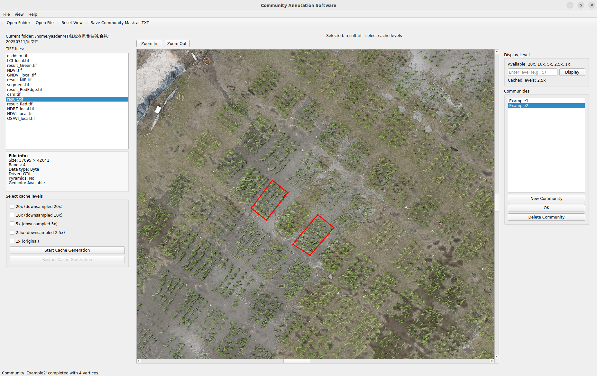

# Community Annotation Software for Orthomosaic Images

A PyQt5‑based tool for **semi‑automated field plot (community) annotation** on RGB orthomosaics generated by DJI Terra from drone‑captured JPG images.

---

## 🎯 Purpose

Designed for agronomic research, this software allows you to:
- **Load** large‑scale TIFF orthomosaics with multilevel caching (1× to 20×) for smooth performance.
- **Mark** polygon vertices by clicking on the image – each plot can be defined by **3 to dozens** of corner points.
- **Automatically generate** convex hull outlines and display them in red.
- **Save** all annotated plots as a plain text file containing plot names and their geographic coordinates (longitude/latitude).
- **Re‑use** the same annotation file across multiple growth stages, enabling *“annotate once, use throughout the entire growth cycle”* – no need to re‑annotate for subsequent drone surveys.

---

## 📸 Screenshot



> *Place a screenshot named `screenshot.png` in the repository root to display it here.*

---

## 📄 Output File Format

The saved TXT file follows a simple format:

<plot_name> lon1 lat1 lon2 lat2 …

For example:
DA1 121.41973697 30.29298816 121.41974267 30.29299519 121.41974854 30.29299021 121.41974246 30.29298392
DA2 121.41974582 30.29298172 121.41975179 30.29298903 121.41975744 30.29298467 121.41975094 30.29297823

This makes it easy to import into GIS, statistical software, or custom analysis pipelines.

## ✨ Key Features

- Supports TIFF files **with or without georeferencing** (converts pixel coordinates to lat/lon when geo‑info is present).
- Interactive **zoom, pan, and point‑by‑point annotation** with real‑time visual feedback.
- **Cache management** for large images (20x, 10x, 5x, 2.5x, 1x) to balance speed and detail.
- **Full English UI** with built‑in user manual (Help → User Manual).
- **Save/Load** community masks for re‑use across multiple visits.

- 
- ---

## 🚀 Getting Started

### Prerequisites
- Python 3.7+
- GDAL (recommended) or tifffile + Pillow as fallback

### Installation
1. Clone this repository:
   ```bash
   git clone https://github.com/zyxyes1/Community-Annotation-Software.git
   cd Community-Annotation-Software

2. Install required packages:

       bash

    pip install PyQt5 numpy gdal Pillow tifffile

        If GDAL installation fails, you can use tifffile and Pillow as fallback.

Usage

    Run the software:
    bash

    python a107-community-annotation-software.py

    Click Open File to load a TIFF orthomosaic.

    Select cache levels (e.g., 10x) and click Start Cache Generation.

    Use New Community → name it → click points on the image → press Finish to create a convex hull.

    Repeat for all communities.

    Click Save Community Mask as TXT to export.

📁 Repository Structure
text

.
├── a107-community-annotation-software.py   # Main application
├── screenshot.png            # (optional) Interface screenshot
├── README.md                 # This file
└── LICENSE                   # MIT License (recommended)

🧑‍💻 Contributing

Contributions are welcome! Please feel free to open issues or submit pull requests.
📄 License

This project is licensed under the MIT License – see the LICENSE file for details.
🙏 Acknowledgements

    Built with PyQt5 and GDAL.

    Inspired by precision agriculture and plant phenotyping research.

text


---


